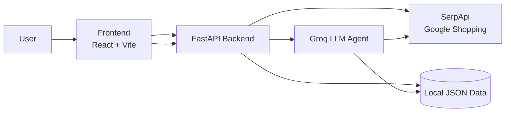

# Ledger

A price intelligence agent built on **SerpApi's Google Shopping API** — search live prices
across sellers, track products over time, and ask it questions in plain English.

Built for the **SerpApi India Hackathon 2026** (Commerce & Market Intelligence track).

## How SerpApi powers this

Every price shown anywhere in this app — live search, tracked snapshots, the AI assistant's
answers — comes from a real SerpApi `google_shopping` call. Nothing is hardcoded or scraped.
The AI layer (Groq/Llama) is only allowed to *phrase* answers from data SerpApi actually
returned; it never generates a price on its own.

## What it does

- **Search** — type a product, get live prices across sellers in seconds
- **Track** — save a product and build real price history, snapshot by snapshot
- **Chart** — see the price trend and spot the lowest-price seller at a glance
- **Ask** — "has the price of X dropped this week?" → the agent tool-calls into real data to answer

## Repository structure

\`\`\`text
price-intel/
├── backend/        FastAPI + SerpApi + Groq agent
├── frontend/        React + Recharts
├── .gitignore
└── README.md
\`\`\`

## Architecture



## API endpoints

| Method | Endpoint | Description |
| --- | --- | --- |
| POST | `/search` | Live price search, no saving |
| POST | `/track` | Start tracking a product, saves first snapshot |
| POST | `/refresh/{product_id}` | New snapshot for a tracked product |
| GET | `/products` | List tracked products |
| GET | `/history/{product_id}` | Snapshot history for a product |
| POST | `/ask` | Natural-language question, agent answers from real data |

## Quick start

Needs two terminals — backend first, then frontend.

### Backend

```bash
cd backend
python -m venv .venv
source .venv/bin/activate      # .venv\Scripts\activate on Windows
pip install -r requirements.txt
cp .env.example .env           # add SERPAPI_KEY and GROQ_API_KEY
uvicorn main:app --reload
```

### Frontend

```bash
cd frontend
npm install
cp .env.example .env           # defaults to localhost:8000
npm run dev
```

Open `http://localhost:5173`. API docs at `http://localhost:8000/docs`.

## License

MIT